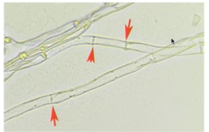

#biol111 
septa::refers to the cross walls in [[hyphae]]. have large pores that allow for the passage of nutrients through [[fungi]], even nuclei which allows the nuclei to travel around the body of a [[fungi]].  septa cross walls in hyphae