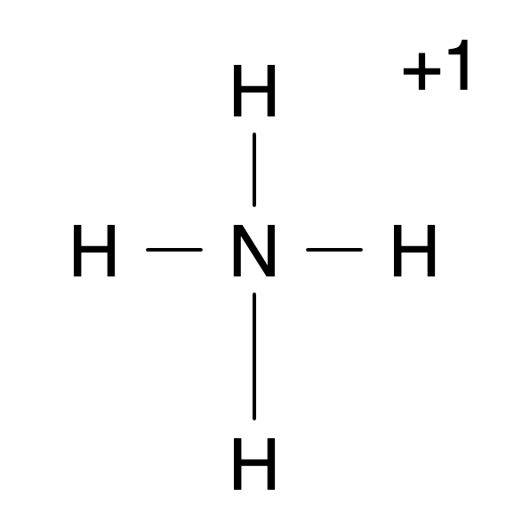

#chem110 
The formal charge of an atom in a molecule is the hypothetical charge the atom would have if we could redistribute the [[Electron|electrons]] in the bonds evenly between the atoms. Formal charge can apply to indvidual atoms the same as the overall ionic compound (e.g. $N^+$ has a formal charge of $+1$ and $H$ has a formal charge of $0$ so $4\cdot0+1 = +1$ - the formal charge of $[NH_4]^+$)
$$
\text{Formal Charge}=\text{Valence Electrons}- \text{Lone Pair Electrons} - \frac{1}{2}\text{Bonding Electrons}
$$

Formal charges predict the most preferable lewis structure.
1. The structure where all charges are 0 is pref to one where they are not
2. If zero formal charge impossible the lowest FC is preferable
3. Lewis structures where adjacent FC are zero or of opposite sign are preferable
4. When deciding between many lewis structures of similar distributions of FC the one with more negative FC on more electronegative atoms is preferable
### Example
ex. $[NH_4]^+$

Valence Electrons: $5$
Lone Pair Electrons: $0$
Bonding Electrons: $8$

Formal Charge = $5-\frac{8}{2}=5-4=+1$