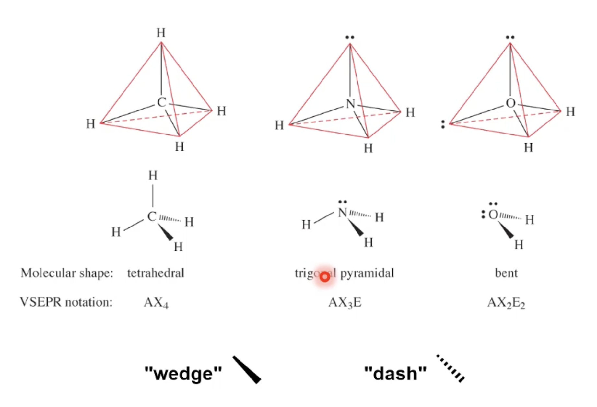

#chem110 
Geometry determines polarity - if $\Delta \chi >0.4$ and shape creates uneven dipoles than a molecule becomes polar. 

polar molecules - created when there isn't symmetry and $\Delta \chi > 0.4$
non-polar molecules - when there is symmetry or $\Delta \chi \leq 0.4$

### Wedge and Dash
