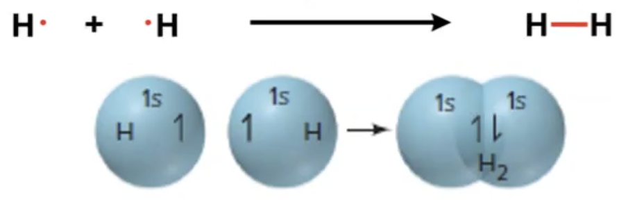
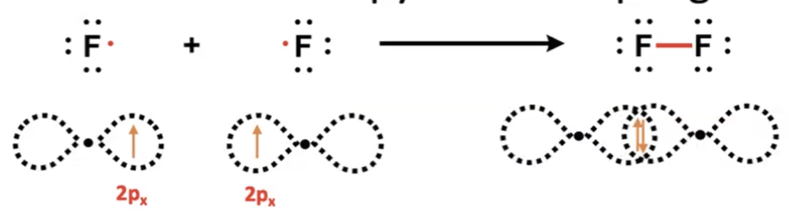
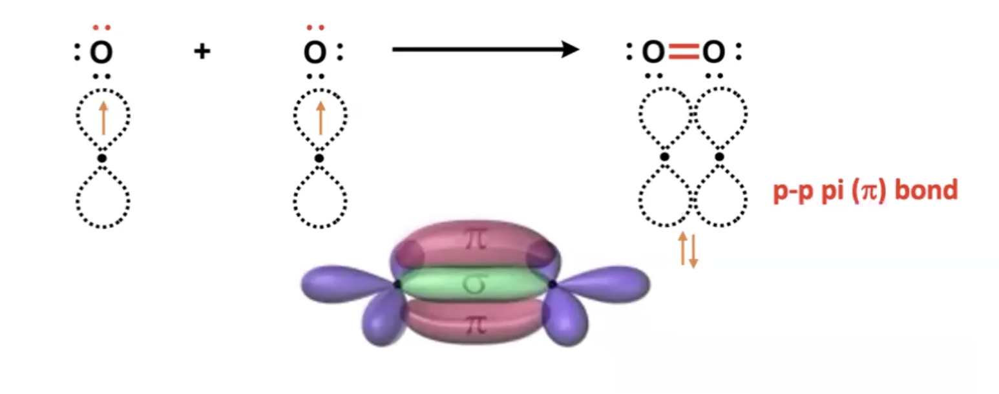

#chem110 
A [[Covalent bonds|covalent bond]] form when orbitals of two atoms overlap and pair of electrons occupy the overlap region.

### Making single bonds
#### $H_2$

The two valence atomic orbitals ($1s$ and $1s$) combine for maximum energy overlap creating a $\sigma$-bond. More specifically it creates a s-s $\sigma$-bond as the two $s$ regions are overlapping to create a filled $s$ [[subshells|subshell]]. 
#### $F_2$

$\sigma$-bond formed from the overlap of two $2p$ orbitals - cylindrically symmetrical around the bond axis. This creates a $p_x-p_x$ $\sigma$-bond

#### $H{Br}$
Creates an $s-p$ $\sigma$-bond
#### $ICl$
Creates an $p-p$ $\sigma$-bond

### Making multiple bonds
#### $O_2$

As well as a $\sigma$ p-p bond a p-p $\pi$-bond is also created