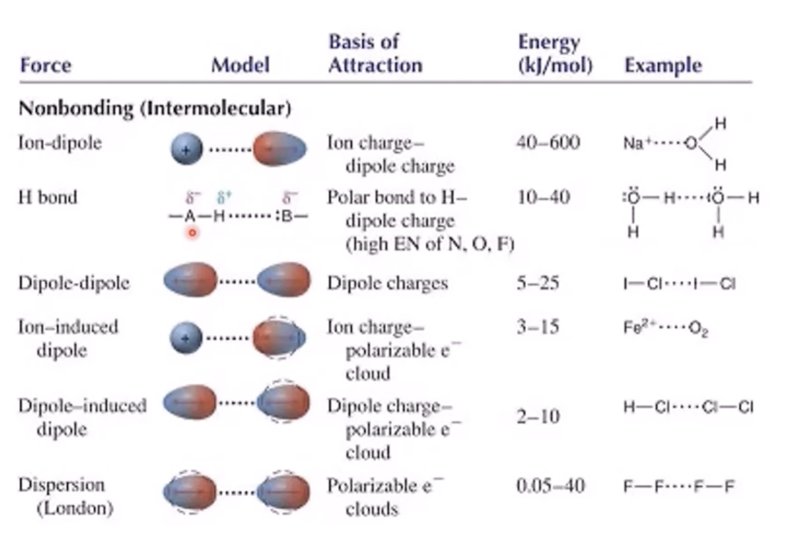

#chem110 
inter vs intra - inter is between intra is across - see [[intramolecular]]. intermolecular forces are weaker than intramolecular forces.

higher intermolecular forces = higher bp

Intermolecular forces depend on polarity of molecular and [[polarisability]].

1. [[ion-dipole force]]
2. [[dipole dipole force]]
3. [[hydrogen bonds]]
4. [[london dispersion forces]]

A nearby electric field can *induce* a distortion in the electron cloud for polar and non-polar molecules. The distortion enhances a dipole moment for a polar molecule and induces a dipole moment for a non polar molecule. 

##### Comparing intermolecular forces between molecules
1. Determine which intermolecular forces are present
2. 1. H-bonding › dipole-dipole > dispersion forces (All molecules have dispersion forces)
2. If comparing two non-polar molecules, compare polarizability (size) and shape (surface area).
3. Compare properties

High intermolecular forces - High boiling point/high surface tension/high viscosity
# Grade 12
Intermolecular forces are the forces between bonded molecules in a substance/solution. All attractive forces between neutral molecules are known as [[van der Waals forces]]. Which are the three forces, LDS, dipole dipole and hydrogen forces, which each uniquely keep molecules together. 

There are four types/categories intermolecular forces, in order of weakest to strongest they are, London dispersion forces, dipole-dipole forces, hydrogen forces and finally ion-dipole forces. Ion dipole forces are not [[van der Waals forces]] because they require non neutrally charged molecules ([[ion|ions]]).

## London Dispersion Forces
Occur between all molecules, no matter there charge (partial or not). Forms because the components of molecules are in constant motion, therefor indicating how at any one time some positive particles could be aligned on one side with the negatives on the other. Inducing a temporary but weak attractive force. 

## Dipole Dipole Forces
The more [[Electronegativity|electronegative]] element in a covalent bond attracts more electrons, therefore that side of the molecule is more negative then the other side. This creates a partial charge on both sides of the molecule, which attracts other partially charged molecules through dipole-dipole induced forces. Recall that a separation of charge is called a [[Dipole]], hence the name dipole dipole forces. 

## Hydrogen Forces
Special forces exist between hydrogen particles and other highly [[Electronegativity|electronegative]] elements known as hydrogen forces. These hydrogen forces only occur between hydrogen and either fluorine, oxygen or nitrogen. The NOF particles. 

## Ion Dipole Forces
The highest intermolecular force is the ion dipole force, existing between all [[Dipole]] and [[ion|ionic]] molecules. 

## Inter vs Intra

![[inter v intra mol forces.png]]

