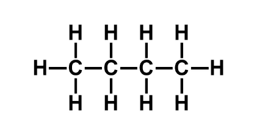

#chem110 
shows the structure of bonds

### Determining Lewis Structures
1. determine total number of valence electrons
2. add charges if there
3. bild a skeleton structure
	1. group 14,15,16 atoms usually central
	2. hydrogen and group 17 usually terminal
	3. make multiple bonds only when necessary
4. check noble gas electronic config for each atom
5. (keep in mind exceptions to the [[octet rule]])