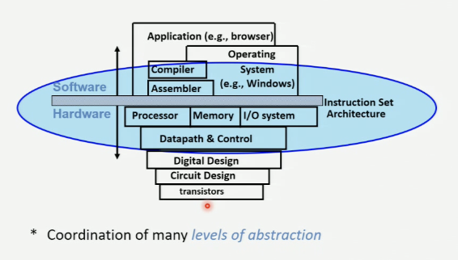

#comp273 
- machine structures 
- parts of any computer
- processor (control - brain and datapath - brawn) -> Memory -> Devices (input + output)

- [[bit]], [[byte|bytes]] and [[word|words]]
- [[bases]]
- [[base conversion]]
- [[binary]]
- 