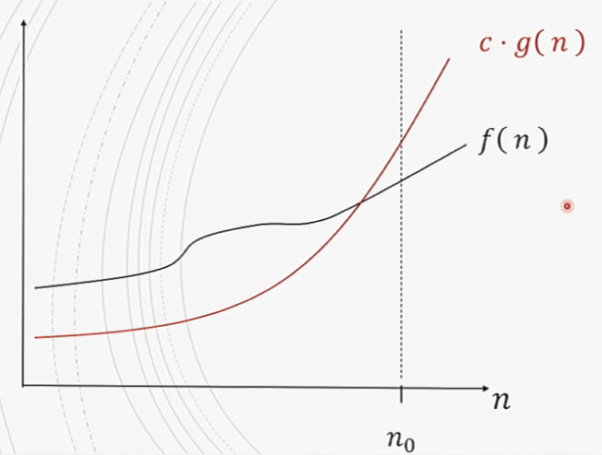

#comp250 
- given a function $g(n)$, we denote $O(g(n))$ as the following set of functions.
	- $O(g(n))=\{$$f(n)$: there exist positive constants $c$ and $n_0$ such that $f(n)\leq cg(n)$ for all $n \geq n_0$}
	- we use O-notation to describe an asymptotic upper bound. 
	- $f$ belongs to big $O$ of $g$ when $cg(n)$ is greater then $f(n)$ for values approaching infinity. All one has to do is find the pair of $n$ and $c$ which produces a function $c\cdot g(n)$ with a value greater then $f(n)$ at a chosen $n$ value. 
	- people often miss-say stuff. saying $f(n)=O(g(n))$ when they mean $f(n)\in{O(g(n))}$
	- does not need to be a tight upper bound. only an asymptotic upper bound. 
	- drop the constants and that is the big $O$ (i.e. $f(n)=5n^2+3n+5$ is $O(n^2)$)
	- O(1) if upper bounded by a constant. Functions will run in a constant time regardless of input.