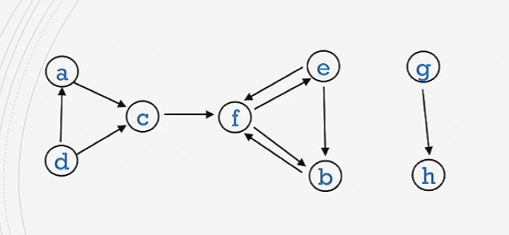
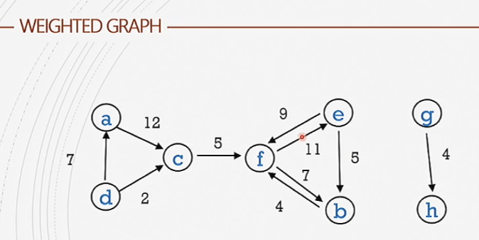
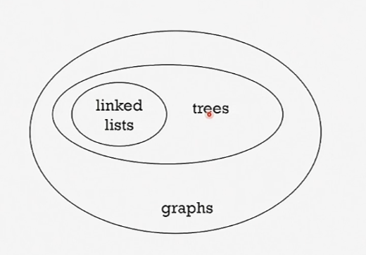
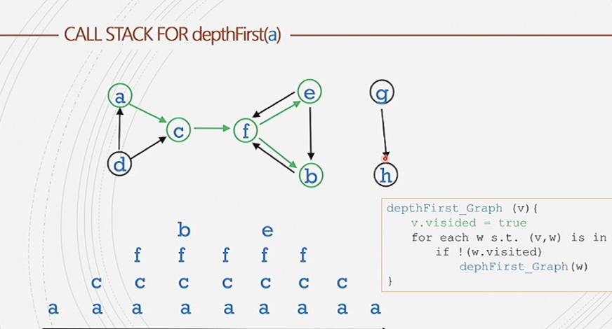

#comp250 

another form


A graph is two sets.

A directed graph is a set of vertices
V={v_I:i\in {1,..,n}}
and set of ordered pairs on these vertices called edges.
E={(v_i,v_j):i,j\in {1,...,n}}

### Examples of Vertices and Edges
Vertices
- airports
- web pages
- influencers

Edges
- flights
- links (URLs)
- follows/likes/comments

### Understanding graphs in a wider context


### Pathing
Can find the shortest path between given points on a vector using something like [[dijkstra's algorithm]]. 


### ADT
```java
class Graph<T>{
	ArrayList <Vertex> vertexList; // All vertices in the graph

	class Vertex <T> {
		ArrayList<Vertex> adjList; // list of all connecting vertex
		T element;
		// boolean visited;
	}

	// If a weighted graph is used
	class Edge <T> {
		Vertex endVertex;
		double weight;
		// ... more stuff to store in the edge
	}
}
```


##### Adjacency Matrix
`boolean [][] adjMatrix = new boolean[n][n]`
A matrix to show the edges of a given number of elements. 


Definitions:
A graph is dense if the number of edges is close to $n^2$
A graph is sparse if the number of edges is close to $n$

##### Graph Traversal
Using the visited boolean we can traverse graphs. Traversing nodes as trees until all  nodes are traversed - traversing a forest so to speak.
```java
depthFirst_Graph (v){
	v.visited = true;
	visit v // do something with v
	for each w such that (v,w) is in E
	// ie. for each w in v.adjList
		if !(w.visited) // avoid the cycles
			depthFirst_Graph(w);
}
```


Using a stack:
```java
graphTraversalUsingStack(v){
	initialize empty stack s
	v.visited = trues.push(v)
	while s is not empty {
		cur = s.pop()visit cur // do something 
		for each w in cur.adjList{
			if(!w.visited){
				w.visited= trues.push(w)
			}
		}
	}
}

```

Using a queue:
```java
graphTraversalUsingQueue(v){
	initialize empty queue q
	v.visited= trueq.enqueue(v)
	while qis not empty {
		cur = q.dequeue()
		for each w in cur.adjList{
			if(!w.visited) {
				w.visited= true           
				q.enqueue(w)
			}
		}
	}
}

```