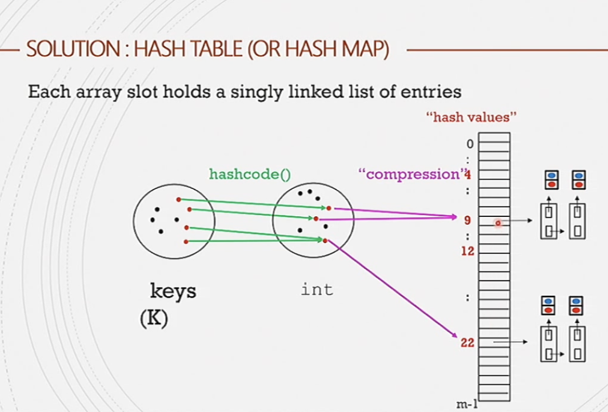

#comp250 
##### ADT
- `put(key, value)` Add the entry `(key,value)` to the map. if the map previously contained an entry with key, the old value is replaced by the specified value
- `get(key)` Returns the value to which the specified key is mapped. 
- `remove(key)` Removes the entry with the specified key. Returns true if the entry was removed, false otherwise.

Map keys to integer values (hash codes) then compress them to a small range. Two strings with the same hashcode may/not be the same. If they are not the same then they are definitely not the same.

Due to compression, we use linked lists at the end to store all colliding values. 

The load factor is \frac{number of pairs}{number of buckets}
TYpically keep the load factor below 1. In the Java hashmap class the maximum load factor is 0.75.

Hashsets, same as hashmaps but not storing the values only the keys. These functions are incredibly powerful but can often be like killing a fly with a gun. 