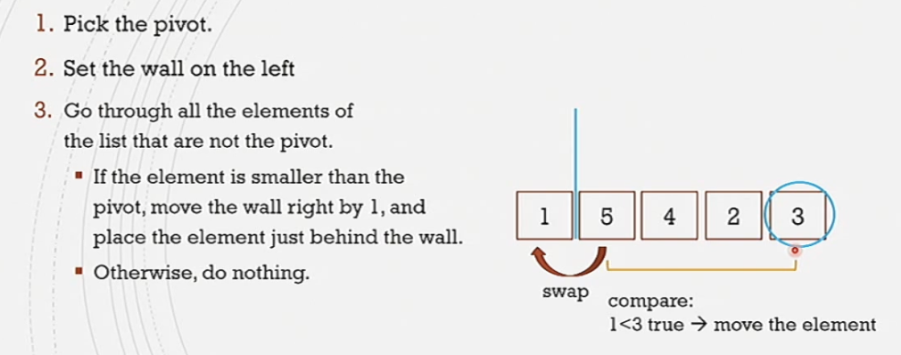

#comp250 
A divide and conquer sorting algorithm

Idea:
- Select pivot element
- Partition the list moving the pivot to its correct position making sure all the lower elements are on its left and the larger elements are on its right
- Sort the left and right of the list separately and [[Recursion|recursively]]
- Keep on going with the recursion until sorted



### Implementation
- A method that swaps two elements
- A way to refer to parts of the list
- A helper method that places the pivot in its correct position and moves the elements around so that all the elements are on the and and larger elements on the right - placeAndDivide
- A method that implements the quick sort, that is:
	- Pick a pivot
	- placeAndDivide
	- quickSort left part
	- quickSort right part

```java
quickSort (list, leftIndex, rightIndex) {
	// base case:
	if (leftIndex>=rightIndex){
		return list; 
	} else { // recursive steps
		i = placeAndDivide(list,leftIndex,rightIndex) // will modify the list. 
		// i = index where the pivot is placed
		quickSort(list, leftIndex, i-1);
		quickSort(list, i+1, rightIndex);
	}
}
```

```java
placeAndDivide (list, leftIndex, rightIndex) {
	// pick the right most element
	pivot = list.get(rightIndex);
	// place the wall to the left of the pivot
	wall = leftIndex -1;
	// go through all elements and compare them to the pivot
	for (int i = leftIndex;i<rightIndex;i++){
		if (list.get(i)<pivot) {
			wall++;
			swap(list.get(i) list.get(wall)); // move element behind the wall
		}
	}
	swap (list.get(rightIndex) list(wall+1)) // move the pivot next to wall
	return wall+1;
}
```