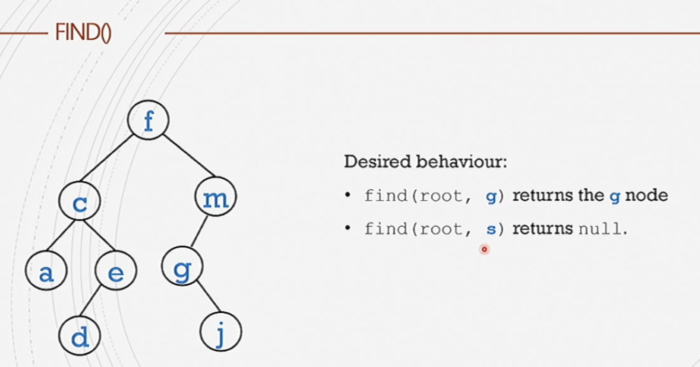

#comp250 
- no matter which node is picked thel
- 
- 
##### find()

```java
find(root, key){
	//returns a node
	if (root == null)
		return null
	else if (root.key == key))
		return root
	else if (key < root.key)
		return find (root.left, key)
	else
		return find (root.right, key)
}
```

##### Add()
The new node is always a leaf. 
```java
add (root, key){
if (root==null)
	root = new BSTnode(key
else if (key <root.key)
	root.left = add(root.left,key)
else if (key>root.key)
	root.right = add(root.right,key)
return root
}
```

##### Remove()
take the largest 
```java
remove (root, key){
	//returns root node
	if(root == null)
		return null
	else if (key <root.key)
		root.left = remove(root.left, key)
	else if(key >root.key)
		root.right = remove(root.right, key)
	else if (root.left== null)
		root =root.right
	else if (root.right== null)
		root =root.left
	} else {
		root.key=findmin(root.right).key
		root.right=remove(root.right,root.key)
	}
	return root
}
```