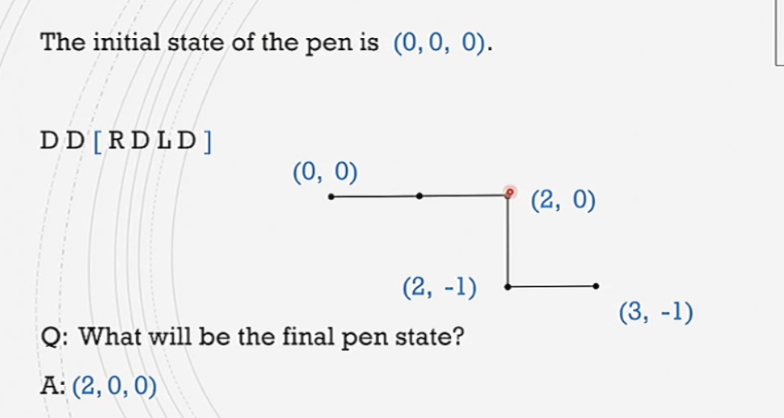
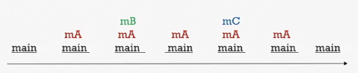

#comp250 

### Stacks ADT
- push(element)
- pop() - first from top in
- peek() - look at top element

### Implementation

|                        | push(e)     | pop()         |
| ---------------------- | ----------- | ------------- |
| [[arraylist]]          | addLast(e)  | removeLast()  |
| singly [[linked list]] | addFirst(e) | removeFirst() |
| doubly [[linked list]] | either row  | above         |
### Example: Brackets problem
1- {} 2 - () 3 - []. 

1. stack all \{\(\[ with 1-3
2. peek all closing brackets
3. pop if same type
4. otherwise return false

### Example: Stacks in graphics

define a pen position and direction $(x,y,\theta)$ where $\theta$ is counter-clockwise degrees from $x$ axis.
let operations be symbols:
D- draw unit length line in direction theta
R - Turn right 90 degrees
L - Turn left 90 degrees
\[ - push state $(x,y,\theta)$
] - pop state, and go to that state

by saving the operations sequentially we can undo draw states.  knowing where the brackets are as starting and ending points.



### Example: "Call Stack"
```java
class Demo {
	void mA(){
		mB();
		mC();
	}
	void mB() { ... }
	void mC() { ... }
	public static void main (...){
		mA();
	}
}
```

[[Stack overflow]] is when a method is pushed onto the stack infinitely - causing an overflow as the variable holding the stack becomes full. Stack underflow is when a stack is empty and we attempt a pop.