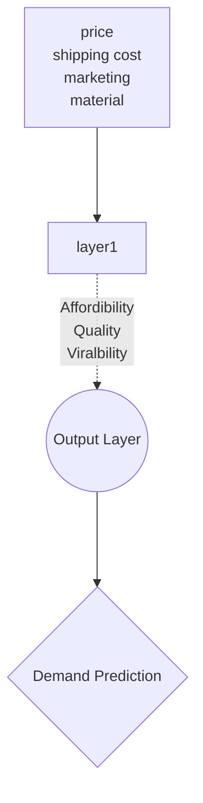

Neural network are interlinked [[Nodes]] of algorithms aimed to mirror the structure of [[Neuron|neuron's]] in the brain. A neural network comprises of multiple [[Layers]] which each take data in from each other in the form of [[Vector]]s. Neural networks are the backbone of more advanced [[Machine Learning]] algorithms present in the [[Deep Learning]] subfield.

### Example of a Neural Network:
* Speech interpretation
* Image interpretation
* Text interpretation

### Demand prediction example
A neural network can be used to predict the demand of a product such as a t-shirt in a clothing store. 


## Convolutional Neural Networks
neural networks comprised primarily of convolutional [[Layers|layers]]. 

# How to acc code them frfr
Using keras we can declare a new model with the following:
```python
model = Sequential(
    [                
        tf.keras.layers.Dense(units = 25, activation="relu"),
        tf.keras.layers.Dense(units = 15, activation="relu"),
        tf.keras.layers.Dense(units = 10, activation="linear")
        
    ], name = "my_model" 
)

model.compile(loss=tf.keras.losses.SparseCategoricalCrossentropy(from_logits=True),
    optimizer=tf.keras.optimizers.Adam(learning_rate=0.001))
```