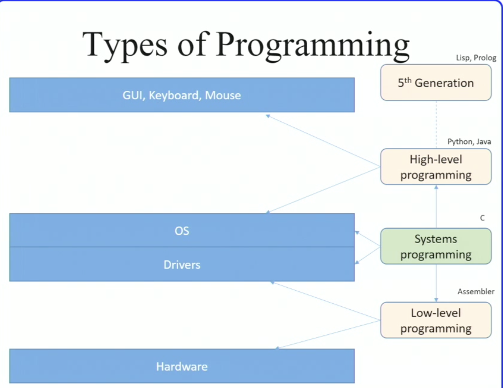

#comp206 
- [[System]]
- [[protocols]]
- [[software]]
	- we are concerned with the second type
		- manual memory management
		- little runtime overhead and running in low resources environments
		- not going to assume portable software (linux constant)
- 
- [[operating system]]
- the road to modern os
	- single system for multiple machines (initially)
	- time sharing
	- [[posix]] - portable operating system interface
	- [[unix os components]]