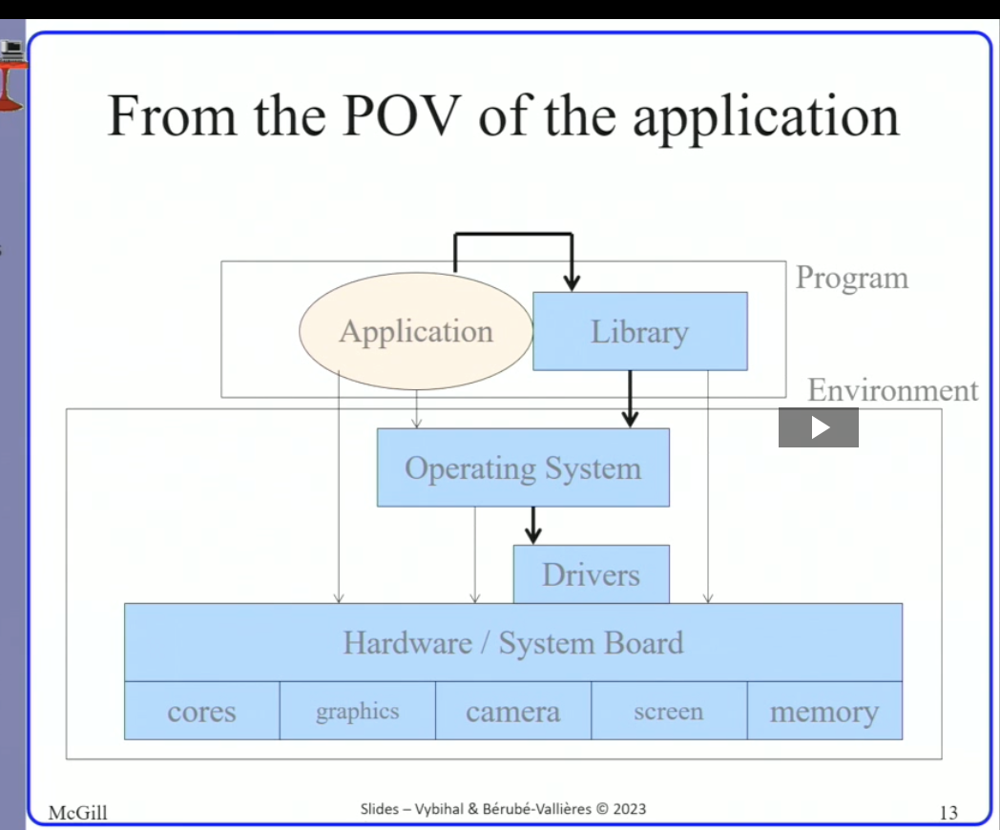

#comp206 
- a piece of software that allows one to interact with a computer without having to know its inner workings
- manages comp resources
- provides libraries to interact with these resources
- 