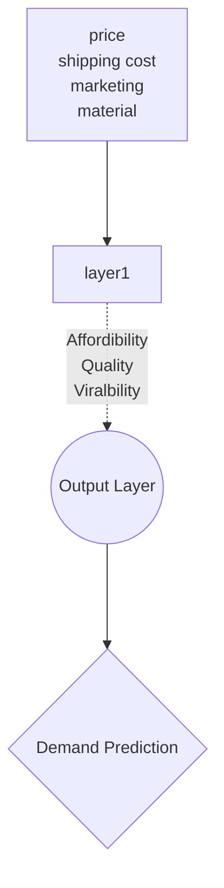

Neural network are interlinked [[nodes]] of algorithms aimed to mirror the structure of [[Neuron|neuron's]] in the brain. A neural network comprises of multiple [[layers]] which each take data in from each other in the form of [[Vector]]s. Neural networks are the backbone of more advanced [[machine learning]] algorithms present in the [[Deep Learning]] subfield.

### Example of a Neural Network:
* Speech interpretation
* Image interpretation
* Text interpretation

### Demand prediction example
A neural network can be used to predict the demand of a product such as a t-shirt in a clothing store. 

