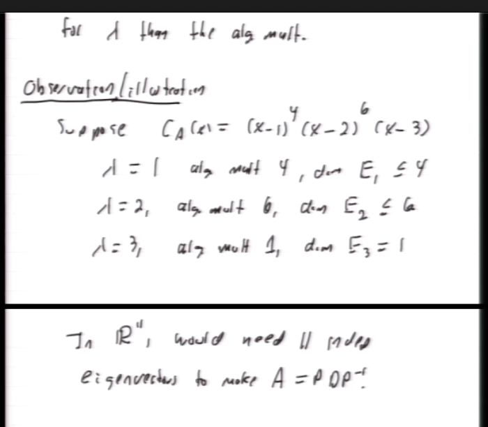
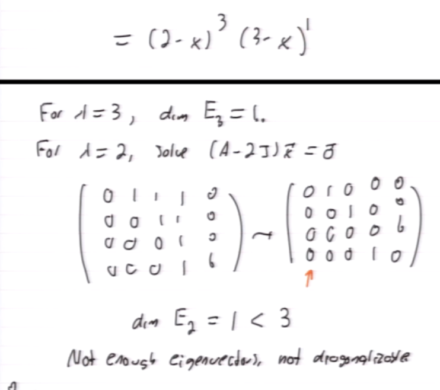
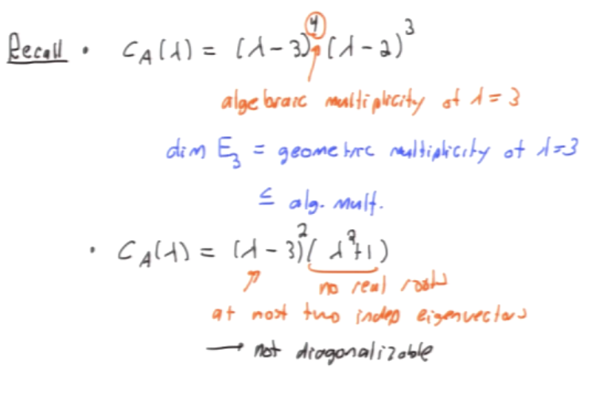
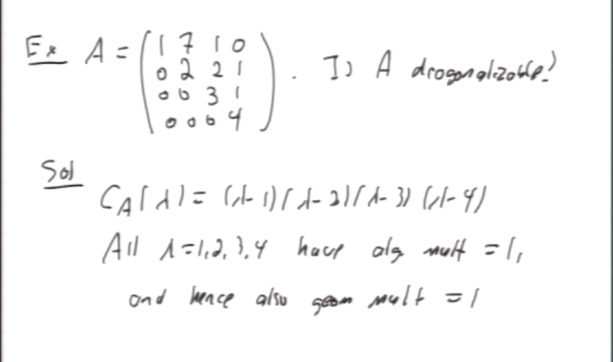
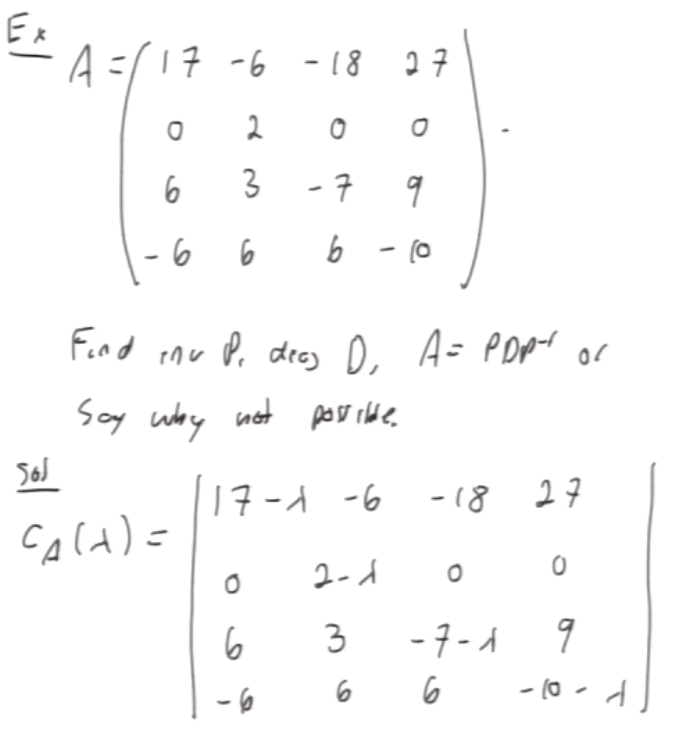
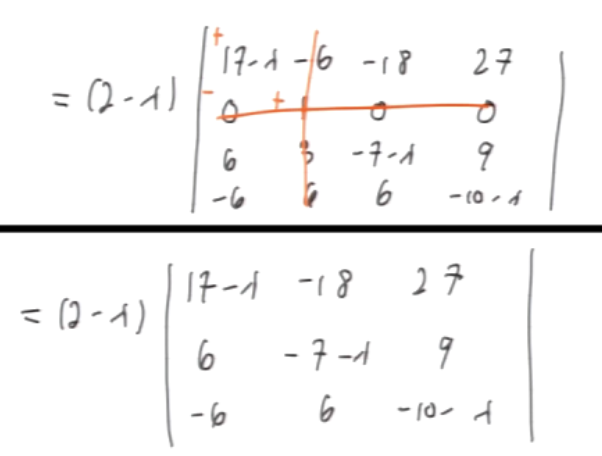

#math133 
Let $\lambda$ be eigenvalue of $A$.
- The algebraic multiplicity of $\lambda$ is the number of times ($x-\lambda$) appears as factor in $C_A(x)$
- The geometric multiplicity of $\lambda$ is dim $E_\lambda$

Theorem
let $\lambda$ be eigenvalue of $A$. Then
1$\leq$ (geo mult of $\lambda$)$\leq$ (alg mult of $\lambda$)
Hence cant have more lin ind. eigenvector for lambda then the alg mult.

Example

If any eigenvalue has geo mult $\lambda <$ (alg. mult $\lambda$) then A is not diagonalizeable.

Theorem
A $n\times n$ matrix then
1. Diagonalizable $\iff$ C_A(x)= factors and for each lambda i the goem mult of it = alg mult of it. 
2. If A diagonizalbe we can take a bases of each eigenspace, combine these into one set and it will be a basis of R^n
Example:

Hence by theorem, A diagonalizable. 

##### Corarlary
If A $n\times n$ matrix has n distinct eigenvalues, then A is diagonalisable.
