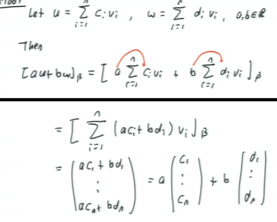

#math133 
### How to change bases
Let $B=${vectors v to v_n} be bases of R^n. Each $\vec{u}\in R^n$ can be uniquely expressed as $u=$ coefficients times vectors v.

Define the [[B-coordinate vector]] of u as $[u]_B=\pmatrix{c_1\\c_2\\...\\c_n}$

Example
$$\{\pmatrix{1\\1\\0},\pmatrix{1\\0\\1},\pmatrix{0\\1\\1}\}$$
are basis R^3
1. Find $[\pmatrix{1\\0\\0}]_B$

$$\pmatrix{1\\0\\1}=\frac{1}{2}\pmatrix{1\\1\\0}+\frac{1}{2}\pmatrix{1\\0\\1}-\frac{1}{2}\pmatrix{0\\1\\1}$$
therefor
$$[\pmatrix{1\\0\\0}]_B=\pmatrix{1/2\\1/2\\-1/2}$$
2. If $u\in R^3$, with $[u]_B$ defined what is $u$
$$u=1\pmatrix{1\\1\\0}+2\pmatrix{1\\0\\1}-3\pmatrix{0\\1\\1}$$
$$=\pmatrix{3\\4\\5}$$

##### Prop
If we define C_B:R^n->R^n by $C_B(u)=[u]_B$ then C_B is linear.

$$=a[u]_B+b[w]_B$$

