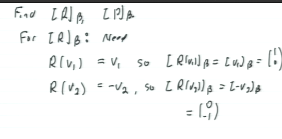

#math133 
Let $E=[\matrix{e_1&...&e_n}]$ std. basis, $B=\{v_1,...,v_n\}$ any bases of $R^n$. The matrix of ln trasf $C_B:R^n->R^n$ called *change-of-coordinates* matrix. 
$Q_E^B$ where $E$ is std bases and $B$ is the new bases. 
$$Q_E^B=[\matrix{[e_1]_B&[e_2]_B&...&[e_n]_B}]$$
ie. std basis bectors in b-coords as columns. 

Prop
For every u\in R^n
1. $Q^B_Eu=[u]_B$
2. $Q_E^B$ is invertible and $u=(Q_E^B)^{-1}[u]_B$ ie. mult of coord by inverse Q computes original vector. we denote 
$$(Q_E^B)^{-1}=Q_B^E$$
and in fact
$$Q_B^E=[\matrix{v_1&v_2&...&v_n}]$$

##### Example
Set B=vectors v_1 to v_3
$$\pmatrix{1\\1\\0},\pmatrix{1\\0\\1},\pmatrix{0\\1\\1}$$
To find $Q_E^B$ need
$$e_1=1/2\pmatrix{1\\1\\0}+1/2\pmatrix{1\\0\\1}-1/2\pmatrix{0\\1\\1}$$
$$e_2=1/2\pmatrix{1\\1\\0}-1/2\pmatrix{1\\0\\1}+1/2\pmatrix{0\\1\\1}$$
$$e_3=-1/2\pmatrix{1\\1\\0}+1/2\pmatrix{1\\0\\1}+1/2\pmatrix{0\\1\\1}$$
So
$$Q_E^B v_2=\frac{1}{2}\pmatrix{1&1&-1\\1&-1&1\\-1&1&1} \pmatrix{1\\0\\1}$$
Inverse will always be the basis vectors. 

Def
Let T:R^n-> R^n be linear, B=vectors v basis R^n. Define matric of T realtive to B as
$$[T]_B=[all T(v_i)_B]$$
ie. columns are T(v_i), in B-coords.

Prop
For any $u\in R^n$,
$[T]_B[U]_B=[T(u)]_B$
ie. $[T]_B$ computes $T$, but relative to basis $B$.

Example
Let R:R^2-R^2 be reflection in line parallel to $\pmatrix{a\\b}$, $P:R^2->R^2$ be projection onto line. set $v_1=\pmatrix{a\\b}$ and $v_2=\pmatrix{-b\\a}$ so $B=v_1$ and $v_2$ basis $R^2$.
Find $[R]_B$ $[P]_B$

So
$[R]_B=\pmatrix{1&0\\0&-1}$
To compute 

Then
T:R^n-R^n linear, B=vectors v
then
$[T]_B=Q[T]_EQ^{-1}$
where [T]_E = matrix for T Q=Q_E^B