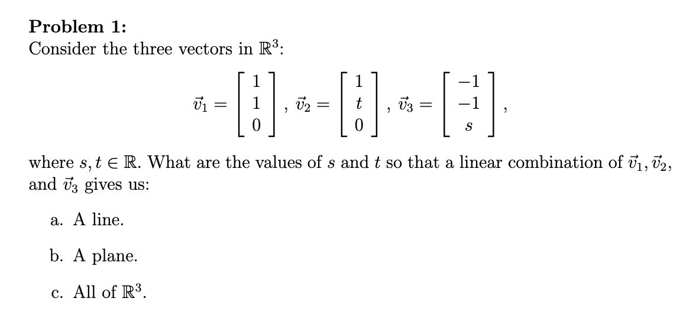
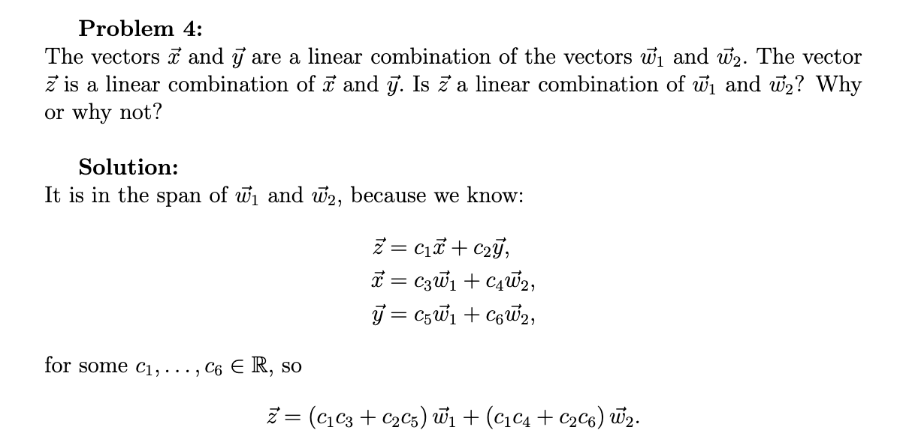

#math133 

##### Identity Matrix
$I_n$ or just $I$ (size through context) is the $n\times n$ [[matrix]] with columns $e_1,e_2,...,e_n$ ([[standard basis vectors]])
$$I_4=\pmatrix{1&0&0&0\\0&1&0&0\\0&0&1&0\\0&0&0&1}$$
##### Matrix Rank
for any [[matrix]] the number of leading ones in the [[reduced row echelon form|RREF]] is the rank
##### Matrix Inverses/Invertible's
If we have matrix $A$ the inverse matrix is $A^{-1}$. We find it with the $AA^{-1}=I$ formula where we simply solve the A matrix with I as the coefficient matrix. A matrix is invertible if its RREF form is the identity matrix.
$$\pmatrix{A\vert I}=A^{-1} \text{ - solve for the LHS to get }A^{-1}$$
###### Inverse of a 2x2 matrix
Let $A=\pmatrix{a&b\\c&d}$. Define the determinant of $A$ by:
$$det(A)=ad-bc$$
If $det(A)\neq 0$ then $A$ invertible and $$A^{-1}=\frac{1}{det(A)}\pmatrix{d&-b\\-c&a}$$
###### Properties
 1. $I^{-1}=I$ - of $II=I$.
 2. If $A$ invertible $A^{-1}$ also invertible. $(A^{-1})^{-1}=A$ $$A^{-1}A=I$$
 3. *very important*. If $A$, $B$ both $n\times n$ invertible then $AB$ is invertible and $$(AB)^{-1}=B^{-1}A^{-1}$$
 4. If $A_1, A_2, ..., A_k$ all $n\times n$ invertible then $A_1,A_2,...,A_k$ is invertible and $$\pmatrix{A_1&A_2&...&A_k}^{-1}=A_k^{-1},A_k^{-1},...,A_2^{-1}$$
 5. If $A$ invertible, $m\geq 1$ (int) then $$A^m \text{ is invertible and } (A^m)^{-1}=(A^{-1})^m$$
 6. If $A$ invertible and $c\in \mathbb{R}$, $c\neq 0$ then $cA$ is invertible and $$(cA)^{-1}=\frac{1}{c}A^{-1}$$
 7. If $A$ invertible $A^T$ also invertible and $$(A^T)^{-1}=(A^{-1})^T$$
###### Prove $A$ is not invertible if $A^n = 0$
1. $A^n=0$
2. $(A^n)(A^n)^{-1}=I$
3. $0(A^n)^{-1}=I$
4. $0\neq I$
Therefor A is not invertible. 
###### Show A is invertible if $A^n=I$
$A^{−1}=A^{n−1}$ since $A^{n−1}A=A^n=I$.
##### Matrix Adjugate - I DON'T UNDERSTAND THIS
$$A^{-1}=\frac{\text{adj}(A)}{\text{det}(A)}$$
##### Elementary Matrices
$$\pmatrix{1&0&0\\3&1&0\\0&0&1}\pmatrix{a&b&c\\d&e&f\\g&h&i}=\pmatrix{a&b&c\\3a+d&3b+e&3c+f\\g&h&i}$$
##### Matrix Transposition
The transpose of a $m \times n$ [[matrix]] $A$ is the $n \times m$ matrix $A^T$ whose $(i,j)$ entry is the $(j,i)$ entry of A. 
$$A=\pmatrix{1&2&3\\4&5&6}\quad\quad A^T=\pmatrix{1&4\\2&5\\3&6}$$
###### Symmetric matrix
A [[matrix]] is $A$ is called [[symmetric matrix|symmetric]] if when [[Matrix Tranposition|transposed]] nothing changes. A symmetric matrix must be $n \times n$.
###### Properties
1. $(AB)^T=B^TA^T$
2. $(A^T)^T=A$
3. $(cA)^T=c(A^T)$
4. $(A+B)^T=A^T+B^T$
###### Properties
1. $(A^T)^T=A$
2. $(cA)^T=c(A^T)$
3. $(A+B)^T=A^T+B^T$

##### Matrix-Vector Multiplication
same as matrix matrix multiplication which is below
###### Properties
Let $A,B$ be $m\times n$ matrices, $\vec{v},\vec{w}\in\mathbb{R}^n, c\in\mathbb{R}$. Then
1. $A(\vec{v}+\vec{w})=A\vec{v}+A\vec{w}$
2. $A(c\vec{v})=c(A\vec{v})$ (LHS is $\in\mathbb{R}^n$ while RHS is $\in\mathbb{R}^m$ since the scalar expands number of solutions??)
3. $(A+B)\vec{v}=A\vec{v}+B\vec{v}$
##### Matrix-Matrix multiplication
###### Properties
1. NOT COMMUTATIVE $AE_1E_2E_3 \neq E_3E_2E_1A$ because $E_1A\neq AE_1$. 

###### Vector-Vector dot product
A special case of matrix matrix multiplication. Scalar result of multiplication of vectors of same dimension. 
If $\vec{v}=[\matrix{a_1&...&a_n}]$ and $\vec{w}=[\matrix{b_1&...&b_n}]$ -  $\vec{v}\cdot \vec{w}=\sum_{u=1}^n{a_ub_u}$. 
##### General Form Solutions
say we have these system of linear equations:
1. $x−2y−z+3w=1$
2. $2x−4y+z=5$
3. $x−2y+2z−3w=4$
which row reduces to:
$$\begin{pmatrix} 1 & -2 & -1 & 3 & \vert & 1 \\ 0 & 0 & 3 & -6 & \vert & 3 \\ 0 & 0 & 0 & 0 & \vert & 0 \end{pmatrix}$$
the ***general solution*** would henceforth be:
$$
\begin{pmatrix}
x \\
y \\
z \\
w
\end{pmatrix}
=
\begin{pmatrix}
2 + 2u - v \\
u \\
2v + 1 \\
v
\end{pmatrix}, \quad u, v \in \mathbb{R}
$$
##### Consistent vs. Inconsistent Solutions
A matrix is consistent if it has *at least one* solution. It is inconsistent otherwise. 

##### Free Variables
- \# of variables matrix rank free variables
##### Homogeneous system
All constants are zero.
### TODO
- Linear Dependance problem: 
- Understand how to find inverses of matrices other than those which are $2 \times 2$.
- 

