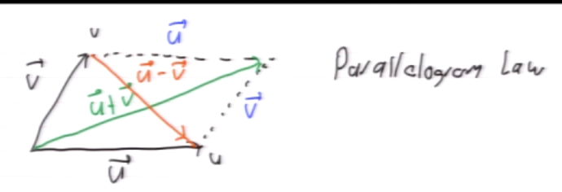

#math133 
### Vectors and lines
##### [[point]]
$p=(a_1,a_2,\dots,a_n)$ is a [[point]] in $\mathbb{R}^n$

##### [[vector]]
$\vec{p}=\pmatrix{a_1\\a_2\\ \vdots\\a_n}$ [[vector]] in $\mathbb{R}^n$

think of a vector as an arrow and a point as a point lmfao

##### Length of a vector
The length of a $\vec{p}$ is $||\vec{p}||=\sqrt{a_1^2+a_2^2+\dots+a_n^2}=$ distance from point p to origin

##### parallel vectors
let $\vec{u},\vec{v}$ vectors. if $\vec{u}=c\vec{v}$ ($c\neq 0$) we say $\vec{u}$,$\vec{v}$ are parallel
- c>0 same direction
- c<0 opposite directions

##### Rescaled vector lengths
$||c\vec{u}||=|c|\cdot ||\vec{u}||$

##### Addition/subtraction of vectors
vector from points p to q - v is found with the following operation
$\vec{v}=\vec{q}-\vec{p}$ - (p to q vector) - remember that a vector from origin isnt the negative version of itself.

##### [[Unit Vector]]
If $||\vec{u}||=1$, $\vec{u}$ called unit vector
if $\vec{u}\neq 0$, $u$ not unit vector then $\vec{v}=\frac{1}{||u||}\cdot\vec{u}$
$\vec{v}$ is a unit vector

##### [[lines]]
let $p_0$ be a [[point]] and $\vec{d}$ a [[vector]].
The line that passes through $p_0$ in the direction $\vec{d}$ is is all points p such that $\vec{p_0}+t\vec{d}$

##### [[parallel, skew and intersecting lines]]
$l_1(t)=p_1+td_1, l_2(t)=p_2+td_2$
1. parallel if $d_1=cd_2$ for some $c\neq 0$
2. Intersecting if $l_1(t_1)=l_2(t_2)$
3. skew lines otherwise

### dot product and projections
$$\begin{align*}
\textbf{Recall:} \quad &\text{If } \vec{u} = \begin{pmatrix} a_1 \\ \vdots \\ a_n \end{pmatrix}, \quad \vec{v} = \begin{pmatrix} b_1 \\ \vdots \\ b_n \end{pmatrix}, \\
&\vec{u} \cdot \vec{v} = \sum_{i=1}^n a_i b_i = \vec{u}^T \vec{v}
\end{align*}
$$
1. $\vec{u}\cdot \vec{u}=||\vec{u}||^2$
2. $\vec{u}\vec{v}=\vec{v}\vec{u}$
3. $u\cdot0=0$
4. for all $c\in \mathbb{R}$, $(c \vec{u}) \cdot \vec{v} = c (\vec{u} \cdot \vec{v}) = \vec{u} \cdot (c \vec{v})$
5. $\vec{u} \cdot (\vec{v} + \vec{w}) = \vec{u} \cdot \vec{v} + \vec{u} \cdot \vec{w}$

##### angles
if u and v are nonzero vectors they form two angles (we always take the smaller one)
$\text{Let } \vec{u}, \vec{v} \in \mathbb{R}^n, \text{ both non-zero. Then,}$
$\vec{u} \cdot \vec{v} = \|\vec{u}\| \|\vec{v}\| \cos \theta$
or
$$\cos \theta = \frac{\vec{u} \cdot \vec{v}}{\|\vec{u}\| \|\vec{v}\|}$$
- the sign of the dot product of u and v can be infered from the angle being greater or less than pi / 2.
##### Orthogonal Vectors
when angle is $\pi/2$ or one of the vectors is zero the dot product of two vectors is zero. because $\cos \theta = \frac{\vec{u} \cdot \vec{v}}{\|\vec{u}\| \|\vec{v}\|}$ simplifies to $0=\vec{u}\cdot \vec{v}$.

##### [[projections]]

The w vector is the projection of v onto u. The w vector is of the same direction of u but with an endpoint closest to v.
$\vec{w} = \text{proj}_{\vec{u}} \vec{v} = \left( \frac{\vec{u} \cdot \vec{v}}{\|\vec{u}\|^2} \right) \vec{u}$

##### [[Plane]]
##### [[cross product]]
