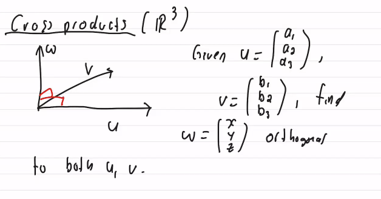
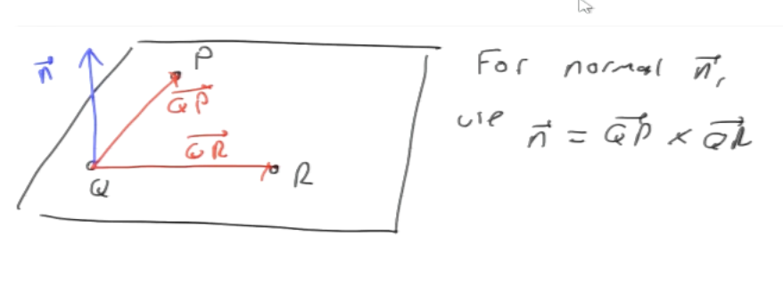
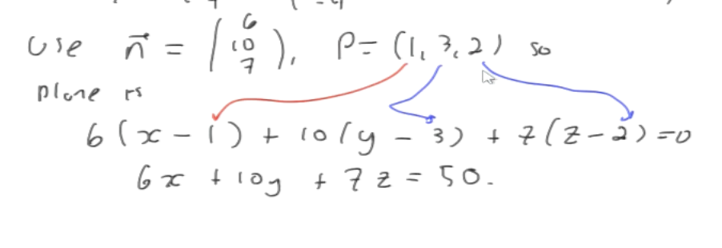
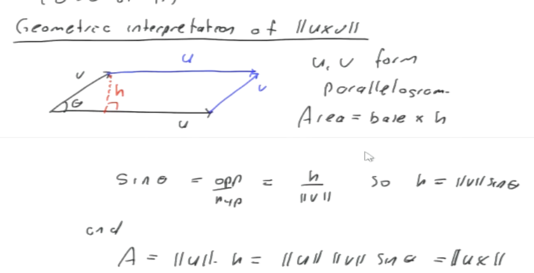
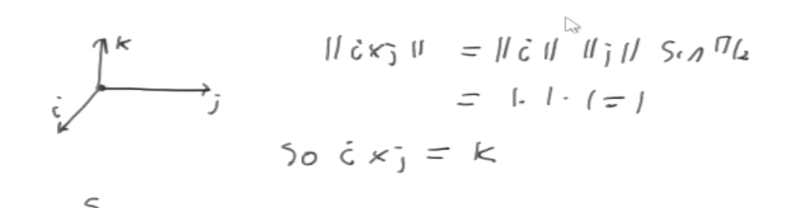

#math133 

The cross product, w, is $u\times v\in\mathbb{R}^3 =\pmatrix{a_2b_3-a_3b_q\\-(a_1b_3-a_3b_1)\\a_1b_2-a_2b_1}$

$u\times v$ is orthogonal to $u$ and $v$, $u\cdot (u\times v)=0$, $v\cdot (u\times v)=0$. 

The direction of the uv cross vector is your thumb using the right hand rule.
In fact, $v\times u = -(u\times v)$

#### Notation
$i=\pmatrix{1\\0\\0}, j=\pmatrix{0\\1\\0}, k=\pmatrix{0\\0\\1}$
$u\times v = \pmatrix{{i} & a_1 & b_1 \\ {j} & a_2 & b_2 \\ {k} & a_3 & b_3}$

#### Problem
$p=(1,3,2), q(3,-1,6), r=(5,2,0)$. find the plane containing those points.

Sol 1: plane ax+by+cz=d. plug in the points to get a system of equations which can than be solved.

Sol 2: Use cross product to find the normal vector.
$\vec{qp}=\vec{p}=\vec{q}=\pmatrix{-2\\4\\-4}$
$\vec{n}=qp\times qr$

#### Sin cross product Theorem
$||u\times v||=||u||\cdot ||v|| \sin{\theta}$
$u\cdot v = ||u||\cdot ||v|| \cos{\theta}$

*Corollary*
let $u, v \in \mathbb{R}^3$, both nonzero. $u$ and $v$ are parallel $\iff u\times v = \vec{0}$

#### Parallelogram cross product

Area of a parallelogram formed by two vectors is $||u\times v||$

#### Cross product of $i,j,k$

### Properties of cross products
let $u,v,w\in \mathbb{R}^3$, $c\in \mathbb{R}$
1. $u\times v = -v\times u$
2. $c(u\times v)=(cu)\times v=u\times (cu)$
3. $u\times(v+w)=u\times v + u\times w$
	$(v+w)\times u = v\times u + w \times u$
4. $u\times u = \vec{0}$
5. $u\times \vec{0}=\vec{0}$

### Examples
evaluate $(i+k)\times (2i+j)$
$i\times 2i+i\times j+k2\times i+k\times j$
$=0+k+2j-i=\pmatrix{-1\\2\\1}$
