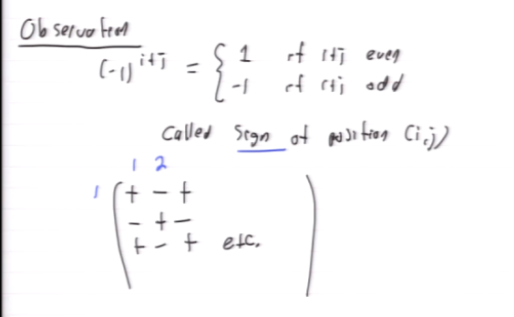
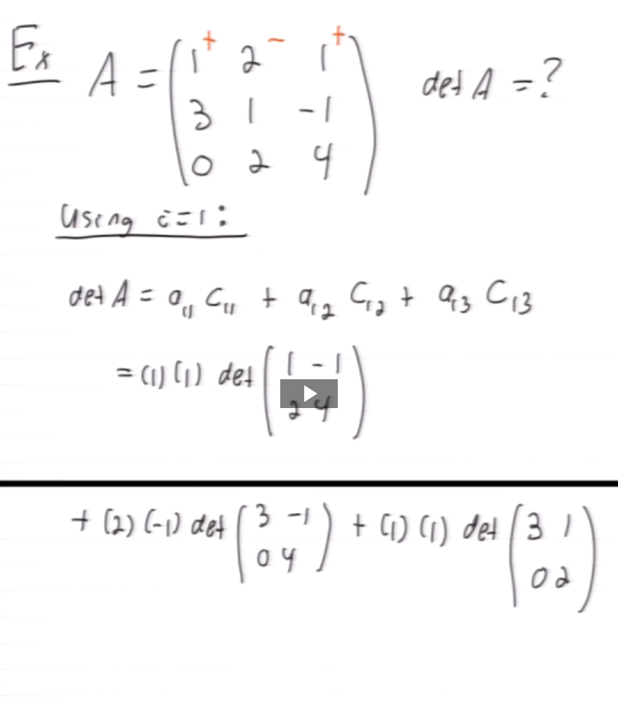
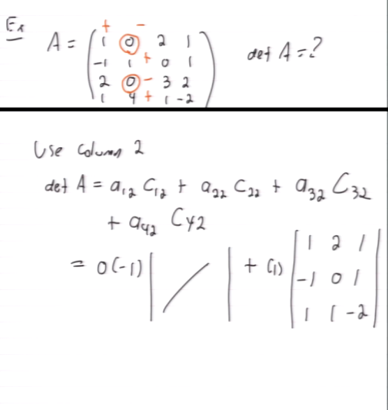
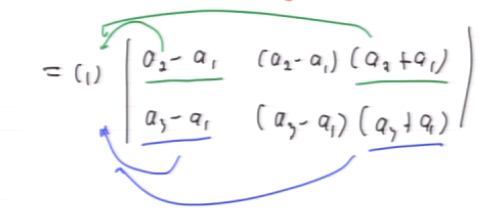
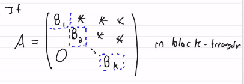

#math133 

### Computing Determinants
def: for A $n\times n$ [[matrix]] define determinants $det(A)$ or $|A|$ as follows. Denote $A=[a_{ij}]$ and $A_{ij}^~ = (n-1)$ $\times$ $(n-1)$ obtained by removing row $i$, column $j$ of $A$. then,
1. If $n=1$, det ([a])=a
2. If $n\geq 2$, let $i$ be any of 1,2,...,n. 
	define $C_{ij}=(-1)^{i+j}det(A_{ij}^(~))$ called (i,j) cofactor. 
	then $det(A)=\sum_{j=1}^n a_{ij}c_{ij}(A)$
			 $=a_{ij}c_{ij}(A)+a_{in}c_{in}(A)$
			 Called cofactor expansion

###### Example 1

###### Example 2

##### Pro 18 - Property of computing a determinant
determinant does not depend on which row i is used and for each $j=1,2,...,n$  $det(A)=\sum_{i=1}^nA_{ij}c_{ij}(A)$

##### notation
$det(A)=|\matrix{a&b\\c&d}|$

### Properties
##### Properties of upper/lower [[Triangular Matrix|triangular matrices]]
if A triangular (upper or lower), $det(A)=$product of entrees on diagonal. det (I) = 1

###### Example
let $V=\pmatrix{1&a_1&a_1^2\\1&a_2&a_2^2\\1&a_3&a_3^2}$
find the det
$=|\matrix{1&a_1&a_1^2\\0&a_2-a_1&a_2^2-a_1^2\\0&a_3-a_1&a_3^2-a_1^2}|$
$=1\cdot |\matrix{a_2-a_1&a_2^2-a_1^2\\a_3-a_1&a_3^2-a_1^2}|$

factor out
$=(a_2-a_1)(a_3-a_1)\cdot |\matrix{1&a_2-a_1\\1&a_3-a_1}|$

##### Properties of square determinants
let $A$ $n\times n$ matrix
1. If $A$ has a row / column of all zeros the $det(A)$ must be zero
2. If $A$ has two identical rows / columns the $det(A)$ must be zero
3. $det(cA)$ $=$ $c^n$ $\cdot$ det$(A)$ - each operation mult determinant by $c$.
4. If matrix block triangular form where each $B_i$ is a square block $det(A) = det(B_1)\cdot ... \cdot det(B_k)$

##### Determinants and [[Elementary Matrices]]
Let $E$ be an [[elementary matrices|elementary matrix]]. Then
1. $det(E)\neq 0$, in fact if [[Elementary Row Operation|ERO]] used to create $E$ was
	1. $R_i$ -> $cR_i$, then $det(E) = c$
	2. $R_i$ -> $R_i + cR_j$, then $det(E)=1$
	3. $R_i$ <-> $R_j$, then $det(E) = -1$
2. If $A$ $n\times n$ matrix, then
	1. $det(EA) = det(E)\cdot det(A)$

##### [[Theorem 23 - Determinants and Invertibles]]
Let $A$ $n\times n$ then,
$A$ invertible $\iff$ $det(A) \neq 0$

##### [[Theorem 24 - Splitting determinants]] 
Let $A,B$ $n\times n$ then,
$\det(AB)=\det(A)\cdot \det(B)$

##### [[Corollary 25]]
let $A$ $n\times n$.
1. If $A$ invertible, $det (A^{-1})=\frac{1}{det(A)}$
2. $det(A^m)=det(A)^m$

##### Prove similar matrices have the same determinant
def: two $n\times n$ matrices $A$, $B$ are similar if there exists $n\times n$ invertible $C$ such that $C^{-1}AC=B$
prob: prove similar matrices have same determinant
$det(B)=det(C^{-1}AC)$
$=det(C^{-1})det(AC)$
$=det(C^{-1})\cdot det(A) \cdot det(C)$
$=det(A)\cdot det(C^{-1})\cdot det(C)$
$=det(A)\cdot \frac{1}{det(C)} \cdot det(C)$
$=det(A)$

##### Prop. 26
let $A$ $n\times n$ then
$det(A^T)=det(A)$

