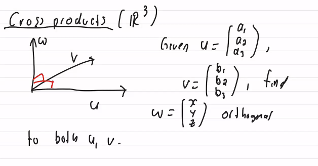

#math133 

## Part 1

##### Identity Matrix
$I_n$ or just $I$ (size through context) is the $n\times n$ [[matrix]] with columns $e_1,e_2,...,e_n$ ([[standard basis vectors]])
$$I_4=\pmatrix{1&0&0&0\\0&1&0&0\\0&0&1&0\\0&0&0&1}$$
##### Matrix Rank
for any [[matrix]] the number of leading ones in the [[reduced row echelon form|RREF]] is the rank
##### Matrix Inverses/Invertible's
If we have matrix $A$ the inverse matrix is $A^{-1}$. We find it with the $AA^{-1}=I$ formula where we simply solve the A matrix with I as the coefficient matrix. A matrix is invertible if its RREF form is the identity matrix.
$$\pmatrix{A\vert I}=A^{-1} \text{ - solve for the LHS to get }A^{-1}$$
###### Inverse of a 2x2 matrix
Let $A=\pmatrix{a&b\\c&d}$. Define the determinant of $A$ by:
$$det(A)=ad-bc$$
If $det(A)\neq 0$ then $A$ invertible and $$A^{-1}=\frac{1}{det(A)}\pmatrix{d&-b\\-c&a}$$
###### Properties
 1. $I^{-1}=I$ - of $II=I$.
 2. If $A$ invertible $A^{-1}$ also invertible. $(A^{-1})^{-1}=A$ $$A^{-1}A=I$$
 3. *very important*. If $A$, $B$ both $n\times n$ invertible then $AB$ is invertible and $$(AB)^{-1}=B^{-1}A^{-1}$$
 4. If $A_1, A_2, ..., A_k$ all $n\times n$ invertible then $A_1,A_2,...,A_k$ is invertible and $$\pmatrix{A_1&A_2&...&A_k}^{-1}=A_k^{-1},A_k^{-1},...,A_2^{-1}$$
 5. If $A$ invertible, $m\geq 1$ (int) then $$A^m \text{ is invertible and } (A^m)^{-1}=(A^{-1})^m$$
 6. If $A$ invertible and $c\in \mathbb{R}$, $c\neq 0$ then $cA$ is invertible and $$(cA)^{-1}=\frac{1}{c}A^{-1}$$
 7. If $A$ invertible $A^T$ also invertible and $$(A^T)^{-1}=(A^{-1})^T$$
###### Prove $A$ is not invertible if $A^n = 0$
1. $A^n=0$
2. $(A^n)(A^n)^{-1}=I$
3. $0(A^n)^{-1}=I$
4. $0\neq I$
Therefor A is not invertible. 
###### Show A is invertible if $A^n=I$
$A^{−1}=A^{n−1}$ since $A^{n−1}A=A^n=I$.
##### Matrix Adjugate - I DON'T UNDERSTAND THIS
$$A^{-1}=\frac{\text{adj}(A)}{\text{det}(A)}$$
##### Elementary Matrices
$$\pmatrix{1&0&0\\3&1&0\\0&0&1}\pmatrix{a&b&c\\d&e&f\\g&h&i}=\pmatrix{a&b&c\\3a+d&3b+e&3c+f\\g&h&i}$$
##### Matrix Transposition
The transpose of a $m \times n$ [[matrix]] $A$ is the $n \times m$ matrix $A^T$ whose $(i,j)$ entry is the $(j,i)$ entry of A. 
$$A=\pmatrix{1&2&3\\4&5&6}\quad\quad A^T=\pmatrix{1&4\\2&5\\3&6}$$
###### Symmetric matrix
A [[matrix]] is $A$ is called [[symmetric matrix|symmetric]] if when [[Matrix Tranposition|transposed]] nothing changes. A symmetric matrix must be $n \times n$.
###### Properties
1. $(AB)^T=B^TA^T$
2. $(A^T)^T=A$
3. $(cA)^T=c(A^T)$
4. $(A+B)^T=A^T+B^T$
###### Properties
1. $(A^T)^T=A$
2. $(cA)^T=c(A^T)$
3. $(A+B)^T=A^T+B^T$

##### Matrix-Vector Multiplication
same as matrix matrix multiplication which is below
###### Properties
Let $A,B$ be $m\times n$ matrices, $\vec{v},\vec{w}\in\mathbb{R}^n, c\in\mathbb{R}$. Then
1. $A(\vec{v}+\vec{w})=A\vec{v}+A\vec{w}$
2. $A(c\vec{v})=c(A\vec{v})$ (LHS is $\in\mathbb{R}^n$ while RHS is $\in\mathbb{R}^m$ since the scalar expands number of solutions??)
3. $(A+B)\vec{v}=A\vec{v}+B\vec{v}$
##### Matrix-Matrix multiplication
###### Properties
1. NOT COMMUTATIVE $AE_1E_2E_3 \neq E_3E_2E_1A$ because $E_1A\neq AE_1$. 

###### Vector-Vector dot product
A special case of matrix matrix multiplication. Scalar result of multiplication of vectors of same dimension. 
If $\vec{v}=[\matrix{a_1&...&a_n}]$ and $\vec{w}=[\matrix{b_1&...&b_n}]$ -  $\vec{v}\cdot \vec{w}=\sum_{u=1}^n{a_ub_u}$. 
##### General Form Solutions
say we have these system of linear equations:
1. $x−2y−z+3w=1$
2. $2x−4y+z=5$
3. $x−2y+2z−3w=4$
which row reduces to:
$$\begin{pmatrix} 1 & -2 & -1 & 3 & \vert & 1 \\ 0 & 0 & 3 & -6 & \vert & 3 \\ 0 & 0 & 0 & 0 & \vert & 0 \end{pmatrix}$$
the ***general solution*** would henceforth be:
$$
\begin{pmatrix}
x \\
y \\
z \\
w
\end{pmatrix}
=
\begin{pmatrix}
2 + 2u - v \\
u \\
2v + 1 \\
v
\end{pmatrix}, \quad u, v \in \mathbb{R}
$$
##### Consistent vs. Inconsistent Solutions
A matrix is consistent if it has *at least one* solution. It is inconsistent otherwise. 

##### Free Variables
- \# of variables matrix rank free variables
##### Homogeneous system
All constants are zero.
## Part 2
##### Determinants
###### 3x3
$$\det{\pmatrix{4&-1&1\\4&5&3\\-2&0&0}}=(+)(4)\cdot \det{\pmatrix{5&3\\0&0}} + (-)(-1)\det\pmatrix{4&3\\-2&0}+(+)(1)\det\pmatrix{4&5\\-2&0}=16$$
###### 4x4+
You can add rows to others without changing the determinant. Use this to get to upper triangular form and compute the determinants by taking the product of the diagonal entries. Otherwise can use same method as above but will take fucking forever.
$$\det\pmatrix{1&2&2&1\\1&2&4&2\\2&7&5&2\\-1&4&-6&3}=\det\pmatrix{1&2&2&1\\0&3&3&1\\0&0&-2&-1\\0&0&0&7}=1\cdot3\cdot-2\cdot7=-42$$
###### Splitting Determinants
Let $A,B$ $n\times n$ then,
$det(AB)=det(A)\cdot det(B)$
###### Inverse determinant relationship
$$det (A^{-1})=\frac{1}{det(A)}$$
###### Inverse and power relationship
$$$det(A^m)=det(A)^m$$
##### Inverses
$$(A:I)->(I:A^{-1})$$

##### Markov Chains
A population migration model. Regions ABC exist. Each year:
- From A, 10% moves to B, 20% to C, 70% stay
- From B, 5% to A, 20% to C, 75% stay
- from C, 5% to A, 5% to B, 90% stay
Forms the transition matrix:
$$\pmatrix{0.7&0.05&0.05\\0.1&0.75&0.05\\0.2&0.2&0.9}=T$$
Where in general, if $\vec{P}_n=$pop in year $n$, if multiply $T\vec{p}_n=\vec{P}_{n+1}$. Also if $T$ inv, $T^{-1}$ will do backwards year prop. Where P is of form $\pmatrix{A\\B\\C}$.
##### Invertible's
A matrix which has an inverse matrix whose product results in the identity matrix is "invertible." $$\text{A matrix is invertible} \iff det(A)\neq0$$
If a matrix is invertible a **unique solution exists.**
##### Cofactor Matrix
$$A=\begin{pmatrix} -1 & -2 & 2 \\ 2 & 1 & 1 \\ 3 & 4 & 5 \end{pmatrix} \text{cofactor of A is }$$$$ C= \text{matrix of minors} \rightarrow \begin{pmatrix} \begin{vmatrix} 1 & 1 \\ 4 & 5 \end{vmatrix} & \begin{vmatrix} 2 & 1 \\ 3 & 5 \end{vmatrix} & \begin{vmatrix} 2 & 1 \\ 3 & 4 \end{vmatrix} \\ \begin{vmatrix} -2 & 2 \\ 4 & 5 \end{vmatrix} & \begin{vmatrix} -1 & 2 \\ 3 & 5 \end{vmatrix} & \begin{vmatrix} -1 & -2 \\ 3 & 4 \end{vmatrix} \\ \begin{vmatrix} -2 & 2 \\ 1 & 1 \end{vmatrix} & \begin{vmatrix} -1 & 2 \\ 2 & 1 \end{vmatrix} & \begin{vmatrix} -1 & -2 \\ 2 & 1 \end{vmatrix} \end{pmatrix} = \begin{pmatrix} 1 & 7 & 5 \\ -18 & -11 & 2 \\ -4 & -5 & 3 \end{pmatrix}$$
$$\quad \text{checkerboard pattern} \rightarrow \pmatrix{1&-7&5\\18&-11&-2\\-4&5&3}$$
##### Adjoint Matrix
$$C^T=adj(C)$$
Property 1:
$$A\cdot adj(C)=\pmatrix{det(A)&0&0\\0&det(A)&0\\0&0&det(A)}$$
Property 2:
$$A^{-1}=\frac{1}{det(A)}\cdot adj(A)$$
##### Polynomial Interpolation
With $n+1$ points can find polynomial $f(x)$ such that $f(x_i)=y_i$ for all $i$. this can be done with polynomial of degree $n$ where $n=i-1$. 
$$\begin{pmatrix} 1 & x_0 & x_0^2 & \dots & x_0^n \\ 1 & x_1 & x_1^2 & \dots & x_1^n \\ \vdots & \vdots & \vdots & \ddots & \vdots \\ 1 & x_n & x_n^2 & \dots & x_n^n \\ \end{pmatrix} \begin{pmatrix} a_0 \\ a_1 \\ a_2 \\ \vdots \\ a_n \\ \end{pmatrix} = \begin{pmatrix} y_0 \\ y_1 \\ \vdots \\ y_n \\ \end{pmatrix}$$
e.g.
You are given the points $(x_0,y_0)=(1,2)$, $(x_1,y_1)=(2,3)$, and $(x_2, y_2) = (3, 5)$. Find the polynomial $f(x)$ of degree $n=3-1=2$ that passes through these points.
$$\pmatrix{1&1&1^2\\1&2&2^2\\1&3&3^2}\pmatrix{a_0\\a_1\\a_2}=\pmatrix{2\\3\\5}$$
forms augmented matrix which reduces to the right.
$$\pmatrix{1&1&1&2\\1&2&4&3\\1&3&9&5}\rightarrow\pmatrix{1&0&0&2\\0&1&0&-\frac{1}{2}\\0&0&1&\frac{1}{2}}$$
therefor
$$a_0=2, a_1=-\frac{1}{2},a_2=\frac{1}{2}$$
forming the polynomial
$$f(x)=2-\frac{1}{2}x+\frac{1}{2}x^2$$
###### [[vandermonde matrix]]
This shit:
$$\begin{pmatrix} 1 & x_0 & x_0^2 & \dots & x_0^n \\ 1 & x_1 & x_1^2 & \dots & x_1^n \\ \vdots & \vdots & \vdots & \ddots & \vdots \\ 1 & x_n & x_n^2 & \dots & x_n^n \\ \end{pmatrix}$$
##### Vectors
###### [[point]]
$p=(a_1,a_2,\dots,a_n)$ is a [[point]] in $\mathbb{R}^n$

###### [[vector]]
$\vec{p}=\pmatrix{a_1\\a_2\\ \vdots\\a_n}$ [[vector]] in $\mathbb{R}^n$

think of a vector as an arrow and a point as a point lmfao

###### Length of a vector
The length of a $\vec{p}$ is $||\vec{p}||=\sqrt{a_1^2+a_2^2+\dots+a_n^2}=$ distance from point p to origin

###### parallel vectors
let $\vec{u},\vec{v}$ vectors. if $\vec{u}=c\vec{v}$ ($c\neq 0$) we say $\vec{u}$,$\vec{v}$ are parallel
- c>0 same direction
- c<0 opposite directions
###### Vector addition (parallelogram law)
If two vectors placed so they have the same initial point, and then complete the vectors into a parallelogram, then the sum of the vectors is the directed diagonal that starts at the same point as the vectors.

###### [[Unit Vector]]
If $||\vec{u}||=1$, $\vec{u}$ called unit vector

**Converting to a unit vector**
if $\vec{u}\neq 0$, $u$ not unit vector then $\vec{v}=\frac{1}{||u||}\cdot\vec{u}$
$\vec{v}$ is a unit vector

##### [[lines]]
let $p_0$ be a [[point]] and $\vec{d}$ a [[vector]].
The line that passes through $p_0$ in the direction $\vec{d}$ is is all points p such that $\vec{p_0}+t\vec{d}$

###### [[parallel, skew and intersecting lines]]
$l_1(t)=p_1+td_1, l_2(t)=p_2+td_2$
1. parallel if $d_1=cd_2$ for some $c\neq 0$
2. Intersecting if $l_1(t_1)=l_2(t_2)$
3. skew lines otherwise

##### Dot Product
If $\vec{u}$ and $\vec{v} \in R^n$ the dot product is
$$\vec{u}^T\cdot\vec{v}$$
1. $\vec{u}\cdot \vec{u}=||\vec{u}||^2$
2. $\vec{u}\vec{v}=\vec{v}\vec{u}$
3. $u\cdot0=0$
4. for all $c\in \mathbb{R}$, $(c \vec{u}) \cdot \vec{v} = c (\vec{u} \cdot \vec{v}) = \vec{u} \cdot (c \vec{v})$
5. $\vec{u} \cdot (\vec{v} + \vec{w}) = \vec{u} \cdot \vec{v} + \vec{u} \cdot \vec{w}$

##### Angles
if $\vec{u}$ and $\vec{v}$ are nonzero vectors they form two angles (always taking the smaller of the two)
$\text{Let } \vec{u}, \vec{v} \in \mathbb{R}^n, \text{ both non-zero. Then,}$
$$\vec{u} \cdot \vec{v} = \|\vec{u}\| \|\vec{v}\| \cos \theta$$
$$\cos \theta = \frac{\vec{u} \cdot \vec{v}}{\|\vec{u}\| \|\vec{v}\|}$$
- the sign of the dot product of u and v can be inferred from the angle being greater or less than pi / 2.
###### Orthogonal Vectors (vectors at right angles to one another)
when angle is $\pi/2$ or one of the vectors is zero the dot product of two vectors is zero. because $\cos \theta = \frac{\vec{u} \cdot \vec{v}}{\|\vec{u}\| \|\vec{v}\|}$ simplifies to $0=\vec{u}\cdot \vec{v}$.
##### Projections
A projection is a scaled vector by the endpoint of another

The w vector is the projection of v onto u. The w vector is of the same direction of u but with an endpoint closest to v.
$\vec{w} = \text{proj}_{\vec{u}} \vec{v} = \left( \frac{\vec{u} \cdot \vec{v}}{\|\vec{u}\|^2} \right) \vec{u}$

##### Hyperplanes
a hyperplane refers to a flat hypersurface, a subspace whose dimension is one less than that of the ambient space. A hyperplane in $\mathbb{R}^2$ is a line, a hyperplane in $\mathbb{R}^3$ is a 2d plane (see [[Plane]]). Can be expressed as a span. Is a kind of subspace but not always a full subspace (not necessary to contain a zero vector)
###### planes
A plane is geometrically a flat 2 dimensional space extending infinitely in in a three dimensional space. It can be described with a [[Linear Equation]] of three variables ($x$,$y$,$z$). A plane is just a [[Hyperplane]] in three dimensions specifically ($\mathbb{R}^3$).

Represented in the form:
$$ax+by+cz=d$$
Where $a$,$b$ and $c$ are coefficients determining the orientation of the plane and $d$ is the constant term which determines the planes position relative to the origin. 
###### Normals Vectors and Planes
every equation $ax+by+cz=d$ is a plane with normal vector $n=\pmatrix{a\\b\\c}$
##### Cross Product

The cross product, w, is $u\times v\in\mathbb{R}^3 =\pmatrix{a_2b_3-a_3b_q\\-(a_1b_3-a_3b_1)\\a_1b_2-a_2b_1}$. uv cross vector is your thumb using the right hand rule. 
1. $v\times u = -(u\times v)$
2. $c(u\times v)=(cu)\times v=u\times (cu)$
3. $u\times(v+w)=u\times v + u\times w$
	$(v+w)\times u = v\times u + w \times u$
4. $u\times u = \vec{0}$
##### Scalar Tripple Product (parallelpiped (sideways box))
1. $V=w\cdot (u\times v) = det (\matrix{w&u&v})$
2. If $A$ $3\times 3$ matrix, |det(A)| is the volume of the parallelpiped formed by its columns
##### Subspace
Let $U\subseteq \mathbb{R}^n$. then $U$ is called a subspace of $R^n$ if the following hold:
1. $\vec{0}\in U$
2. If $u,v \in U$, then $u+v \in U$ (closure under addition)
3. If $u \in U$ and $c\in R$, then $cu\in U$. (closure under scalar multiplication)
If all 3 hold. write $U\subseteq R^n$
A subspace can be defined with infinitely many vectors while a span is more specific.
##### Span
Same as a subspace but vectors are explicitly defined. A specific way to construct a subspace given a set of vectors. 
##### Linear Independence
Let $X=\{u_1,u_2,...,u_m\}$ vectors in \mathbb{R}^n. X called linearly independent if the only solution to the following
$$\vec{0}=c_1u_1+...+c_mu_m$$
*note: empty set is considered linearly independent*
To show independence solve the given vectors as a linear system. If the solution is trivial (only one solution) the solution is independent. Elsewise it is dependent. 
1. $v$ is dependent $\iff v=0$
2. set of zero vectors dependent

###### Linear Independence and Invertible matrices
10. The columns of $A$ are linearly independent
11. The columns of $A$ span $R^n$
12. The rows of $A$ are lin independent
13. The rows of $A$ span $R^n$

##### Column Space
The span of a matrices columns
##### Row Space
The span of a matrices rows or the transpose of the column space
##### Bases
Let U be a subspace of $R^n$. $u_1,...,u_m \in U$. We call these vectors a **basis** of $U$ if
1. $span\{u_1,...,u_m\}$=$U$ (enough vectors to create U)
2. Vectors are linear independent (no excess vectors)
A basis is s simplified span/subspace containing only linearly independent vectors

To build a basis take vectors and continuously add (checking for independence) to the span until they form the span. 
###### Standard Basis
$\{e_1, \dots, e_n\}$ is the standard basis of $\mathbb{R}^n$.

##### Dimensions
The dimension of subspace U is the number of vectors in the basis of that subspace. The subspace containing just $\vec{0}$ has a dim of 0.
1. If a U has dim=m the m vectors building a set $X$: $X$ is independent $\iff span(X)=U$
2. let u,v,w be mutually orthogonal. show they form basis R^3. Since dim(R^3)=3 so long as three vectors mutually independent (can check with det of matrix) then the vectors form basis.

##### nullspace
The vectors which substitute x to satisfy the equation Ax=0 for a given matrix. The nullspace is a subspace. A set of all vectors which build the solution Ax=0.
###### nullity
dimension of null(A) is called the nullity of A.
###### rank nullity theorem
 n=rank(A)+nullity(A) since r+(n-r)=n

##### Linear Transformations
A function T:R^n->R^m is a linear transformation (function and transformation are the same just transformation is the word used in linear algebra) if
1. $T(u+v)=T(u)+T(v)$ for all u,v\inR^n- property puts restrictions on what the transformations can do
2. $T(cu)=cT(u)$ for all $u\in R^n$,$c\in R$
3. $T(\vec{0}_n)=\vec{0}_m$ - really quick way to check if a lin trans is valid.

##### Standard Matrix
Let $T:\mathbb{R}^n->\mathbb{R}^m$ be linear transformation. The standard matrix of $T$ is the $m\times n$ $[T]=[T(e_1)...T(e_n)]$ ie. matrix whose columns are values of T on standard bases.

##### Rotations
$$[R_\theta]=\pmatrix{cos\theta&-sin\theta\\sin\theta&cos\theta}$$
##### Surjective and Injective
$T:\mathbb{R}^n->\mathbb{R}^m$ a function
1. $T$ called onto (or surjective) if $im([T])=\mathbb{R}^m$
2. $T$ called one-to-one (or injective) if for all $u\neq v$. in $\mathbb{R}^n$ we have $T(u)\neq T(v)$ (no two inputs go to the same output). Equivalently if $T(u)=T(v)$ then $u=v$.
Theorems:
1. $T$ surjective $\iff$ $rank (T)=m$
2. $T$ injective $\iff$ $nullity(T)=0$ ($Ker(T)=\{\vec{0}\}$)
###### bijective
$T$ bijective (surjective and injective) $\iff$ $T$ invertible

##### Diagonal Matrix
A $m\times n$ matrix of form where $\lambda_i$ is any value is called a diagonal matrix.
$$\mathbf{D}^m = 
\begin{pmatrix}
\lambda_1^m & 0 & \cdots & 0 \\
0 & \lambda_2^m & \cdots & 0 \\
\vdots & \vdots & \ddots & \vdots \\
0 & 0 & \cdots & \lambda_n^m
\end{pmatrix}, m\geq 1
$$

##### Eigenvalues and eigenvectors
A $n\times n$ matrix if $v$ is a nonzero vector in $\mathbb{R}^n$ and
$$Av=\lambda v$$
then $v$ called an eigenvector of $A$ with eigenvalue $\lambda$. An eigenvector is a vector only scaled by a given transformation, and an eigenvalue is the scalar for that vector. 
###### Finding eigenvectors and eigenvalues

##### Characteristic Polynomials
The characteristic polynomial of a n\times n matrix is 
$$C_A(\lambda)=det(A-\lambda I)$$
###### Characteristic polynomials and eigenvalues
$\lambda$ is a eigenvalue of $A$ $\iff$ $\lambda$ is root of the characteristic polynomial.

##### Diagonalisation
$A$ $n\times n$ matrix called diagonalisable if there is a basis $v$ of $R^n$ where all $v_i$ are eigenvectors of A. 
A diagonalisable $\iff$ alg mult. of $\lambda$ $=$ geo. mult. of $\lambda$ for all $\lambda$ entries. 

##### algebraic multiplicity
algebraic multiplicity $=$ $\#$ of times $x-\lambda$ appears as factor in characteristic polynomial ($C_A(x)$)

##### geometric multiplicity
geometric multiplicity of $\lambda = dim(E_\lambda)$  - The eigenspace dimension for all eigenvectors of $A$.

##### Trace
The trace of $A$ $n\times n$ matrix is the sum of entrees on diagonal.
