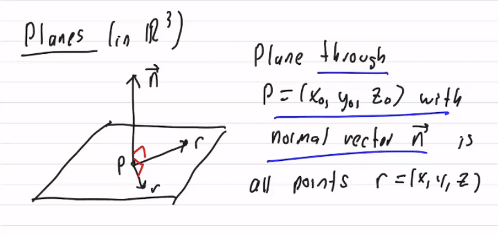
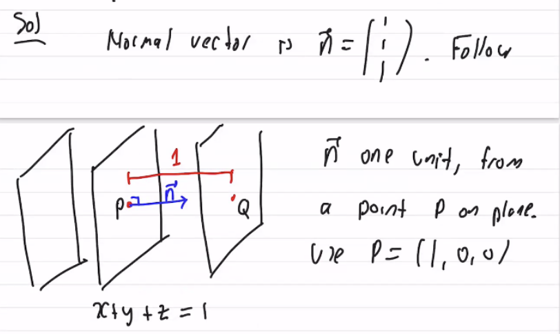

#math133 

Plane through $p=(x_0,y_0,z_0)$ with normal vector $\vec{n}$ is all points $r=(x,y,z)$. Such that $n\cdot (r-p)=0$ "vector equation." That is $\pmatrix{a\\b\\c}\cdot \pmatrix{x-x_0\\y-y_0\\z-z_0}=0$. $a(x - x_0) + b(y - y_0) + c(z - z_0) = 0$ "scalar form." or $ax+by+cz=d$ ($d=zx_0+by_0+cz_0$)

#### Notes
1. every equation $ax+by+cz=d$ is a plane with normal vector $n=\pmatrix{a\\b\\c}$ eg. $2x+3y+4z=10$ has $n=\pmatrix{2\\3\\4}$
2. Try some things in $\mathbb{R}^2$: Line through $p=(x_0,y_0)$ with normal $n=\pmatrix{a\\b}$ is all $r=(x,y)$ such that $n\cdot (r-p)=0$

#### Problem
Find the two planes parallel to x+y+z=1 and 1 unit away.

Normalize $n$ to $n_1=\frac{1}{||n||}n$
Q=p+n_1
one plane is 
$x+y+z=1+\frac{3}{\sqrt{3}}$
because the difference is the normalised normal vector of the origin plane. blah blah blah

