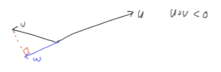
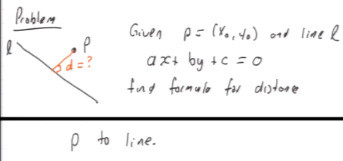
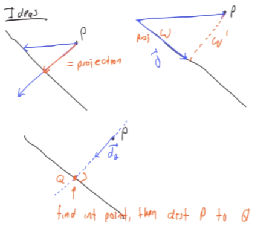
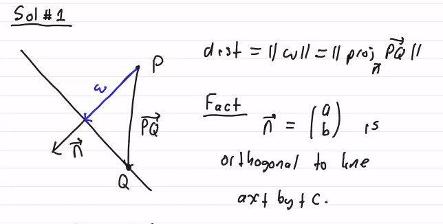
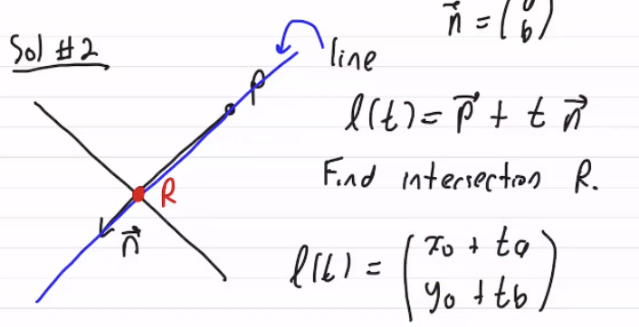

#math133 
### Overview

The w vector is the projection of v onto u. The w vector is of the same direction of u but with an endpoint closest to v.
$$\vec{w} = \text{proj}_{\vec{u}} \vec{v} = \left( \frac{\vec{u} \cdot \vec{v}}{\|\vec{u}\|^2} \right) \vec{u}$$

This is done automatically.

### notes
- if uv>0, w same dir as u. uv< w opp dir.
- $||w||=\frac{|u\cdot v|}{||u||}$
- $w'=v-w$

### Problem - find the distance to a point from a line using projections

Solution / approaches

###### Sol 1: 

$dist=\frac{|-c-ax_0-by_0|}{\sqrt{a^2+b^2}}$

###### Sol 2:

$l(t)=p+tn$ - expands to $l(t)=\frac{x_0+ta}{y_0+tb}$
find the intersection, $R$, by subbing in $ax+by+c=0$ with the line formula.
$a(x_0+ta)+b(y_0+tb)+c=0$
$ta^2+tb^2=-ax_0-by_0-c$
$t_0=\frac{-ax_0-by_0-c}{a^2+b^2}$
so
$R=l(t_0)=\vec{p}+t_0\vec{n}$
but we need the distance
dist p to r $= ||R-P||=||t_0n||=|t_0|\cdot||n||$
$=\frac{|-ax_0-by_0-c|}{\sqrt{a^2+b^2}}$
