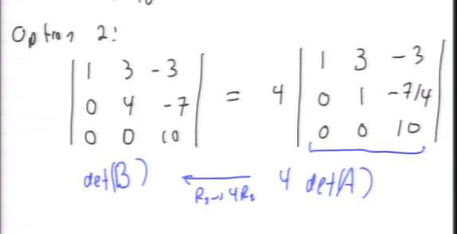

#math133 
Suppose $A$ $n\times n$ and A-> B with one ERO. Then
I. If [[Elementary Row Operation|ERO]] was $R_i->cR_i$ - $det(B) = c\cdot det(A)$
II. If ERO was $R_i->R_i+cR_i$ - det(B)=det(A) (useful because you can reduce by adding other rows to make it have more zeros - easier calc)
III. If ERO was $R_i ->R_j$ - det(B) = -det(A)

### Examples

